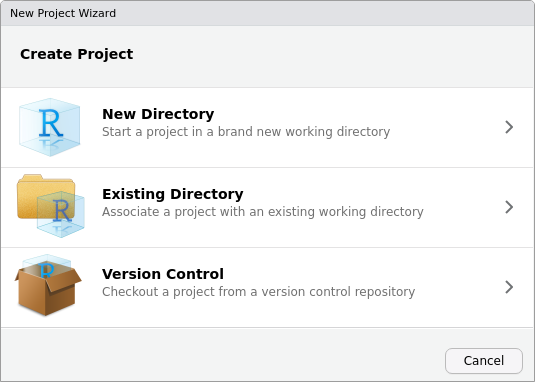
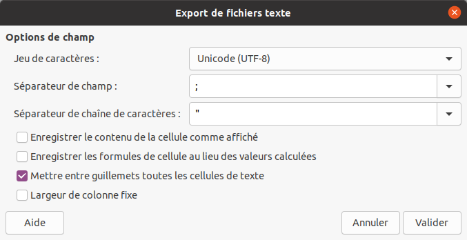

\appendix

# (PART) Annexes {-}

# Fonctions utiles {#cheat-sheet}

## Séquences {#fonctions-sequences}

```{r}
# Séquence de nombres entiers
1:10
```

```{r}
# Séquence de 1 à 10
seq(1, 10)

# Séquence de 1 à 10 par pas de 2
seq(1, 10, by = 2)
```

```{r}
# Séquence de 10 entiers
seq_len(10)
```

```{r}
x <- c(8.6, 4.1, 3.9, 7, 1.8, 6.9, 1.6, 3.8, 2.6, 5.5)
length(x)

# Séquence de même longueur qu'un objet
seq_along(x)
```

# Bonnes pratiques {#bonnes-pratiques}

## Travailler par projets {#projets}

Une bonne pratique liée à l'utilisation de R consiste à [organiser l'ensemble de son analyse en un projet](https://rstats.wtf/project-oriented-workflow.html), c'est à dire un dossier autonome contenant l'ensemble des fichiers nécessaires à l'analyse (dont les données brutes et le fichiers générés). Une telle organisation doit permettre de déplacer le dossier sur son ordinateur ou sur un autre ordinateur, tout en maintenant le bon fonctionnement du code (absence de liens brisés, de dépendances manquantes...).

Ce dossier, ou répertoire de travail (*working directory*), peut être défini ou retrouvé à l'aide des fonctions `setwd()` et `getwd()`, respectivement :

```{r, eval=FALSE}
# Définition du répertoire de travail
setwd("/chemin/vers/mon/dossier")
```

Une fois le répertoire de travail défini, toute référence à un fichier en utilisant un simple nom de fichier ou un chemin relatif sera interprétée relativement au répertoire de travail.

Cependant, le risque est de se retrouver dans la situation suivante :

```{r, eval=FALSE}
# Définition du répertoire de travail
setwd("/chemin/uniquement/valide/sur/mon/ordinateur")
```

Pour pallier ce problème qui rend difficilement déplaçable un dossier de projet, il existe différentes solutions parmi lesquelles :

* L'utilisation du package [*here*](https://here.r-lib.org/),
* L'utilisation de la gestion de projet dans RStudio.

RStudio dispose d'un mécanisme permettant de [créer facilement de tels projets](https://support.rstudio.com/hc/en-us/articles/200526207-Using-Projects). Il est possible de créer un projet dans RStudio à partir du menu déroulant situé en haut à droite de l'interface ou en cliquant sur *New Project...* depuis le menu *File*. Le projet peut alors être créé soit dans un nouveau dossier, soit en transformant un dossier existant (fig. \@ref(fig:rstudio-project)).

```{r rstudio-project, echo=FALSE, fig.cap="Création d'un projet avec RStudio."}

```

Un projet créé par RStudio est reconnaissable par la présence d'un fichier `.Rproj`. Ce fichier marque le dossier de plus haut niveau au sein d'un projet (répertoire de travail), à partir duquel des chemins d'accès relatifs peuvent être utilisés pour lire ou écrire des fichiers. Le répertoire de travail est automatiquement définit lors de l'ouverture d'un projet RStudio : il n'est plus nécessaire d'utiliser `setwd()`.

L'organisation des fichiers et des sous-dossiers au sein d'un projet relève des habitudes de travail de chacun. S'il n'existe pas de consensus sur la manière d'organiser les fichiers à l'intérieur d'un projet, il peut cependant être avantageux de suivre certaines conventions (fig. \@ref(fig:xkcd-documents)), comme celles utilisées par le package [*rrtools*](https://github.com/benmarwick/rrtools) par exemple.

(ref:xkcd-documents) Documents. "Copy of Copy of Copy of Copy of Copy of Copy of Copy of Copy of Copy of Copy of Copy of Copy of Copy of Copy of Copy of Copy of Copy of Copy of Copy of Copy of Copy of Copy of Copy of Copy of Copy of Copy of Copy of Copy of Copy of Copy of Copy of Copy of Copy of Untitled.doc" [CC BY-NC 2.0 @munroe2014].

```{r xkcd-documents, echo=FALSE, out.width='50%', fig.cap="(ref:xkcd-documents)"}
knitr::include_graphics("images/xkcd_documents.png")
```

## Sauvegarder ses données {#csv}

Une fois vos données correctement structurées, choisissez un format de fichier adapté pour les archiver, les diffuser ou les réutiliser (fig. \@ref(fig:xkcd-norm)). De manière générale, conservez vos données dans un [fichier texte](https://fr.wikipedia.org/wiki/Fichier_texte).

Dans le cas des données tabulaires, utilisez le format <abbr title="comma-separated values">CSV</abbr>. Comme son nom l'indique, un fichier <abbr title="comma-separated values">CSV</abbr> est un fichier texte contenant des valeurs séparées par une virgule. Cette simplicité lui confère plusieurs avantages, ce qui en fait le format idéal pour pérenniser des données :

* Un fichier <abbr title="comma-separated values">CSV</abbr> est une suite de caractères et de retours à la ligne : il est facilement éditable et peut aussi bien être lu par un humain (les données ne sont pas encodées) que par une machine.
* Le format <abbr title="comma-separated values">CSV</abbr> est un format ouvert : son utilisation ne dépend pas d'un éditeur particulier. Un fichier <abbr title="comma-separated values">CSV</abbr> peut ainsi être lu ou écrit par n'importe quel logiciel capable de manipuler des feuilles de calcul (ou par un simple éditeur de texte).
* Le format <abbr title="comma-separated values">CSV</abbr> est un format bien établi (ses origines remontent aux années 1970), il ne risque pas de subir un [changement dramatique de spécification](https://www.bbc.com/news/technology-54423988).
* Son apparente austérité (il ne contient pas de formatage) oblige a structurer correctement ses données.

(ref:xkcd-norm) .NORM Normal File Format. "At some point, compression becomes an aesthetic design choice. Luckily, SVG is a really flexible format, so there's no reason it can't support vector JPEG artifacts." [CC BY-NC 2.0 @munroe2019].

```{r xkcd-norm, echo=FALSE, out.width='50%', fig.cap="(ref:xkcd-norm)"}
knitr::include_graphics("images/xkcd_norm_normal_file_format.png")
```

La simplicité et la souplesse de ce format nécessitent cependant un peu de prudence au moment de la création d'un fichier <abbr title="comma-separated values">CSV</abbr>. Il est en effet possible d'utiliser n'importe quel caractère en guise de séparateur à la place d'une virgule. Si votre tableur est paramétré en français, par défaut, les données seront séparées un point-virgule pour éviter les confusions avec le séparateur décimal (de même, lors de l'ouverture d'un fichier <abbr title="comma-separated values">CSV</abbr> votre éditeur s'attendra à trouver des valeurs séparées par un point-virgule). Pensez à bien paramétrer votre logiciel lors de l'import ou de l'export d'un fichier <abbr title="comma-separated values">CSV</abbr> dans un tableur (fig. \@ref(fig:calc-csv)).

```{r calc-csv, echo=FALSE, fig.cap="Paramètres lors de l'export d'un fichier au format CSV avec LibreOffice Calc (choisissez l'encodage de caractères UTF-8 et un séparateur de champ adapté)."}

```

::: {.rmdcaution}
Méfiez-vous de votre tableur ! Ces derniers ont tendance à réaliser automatiquement des conversions qui ne sont pas sans [conséquences](https://www.theverge.com/2020/8/6/21355674/human-genes-rename-microsoft-excel-misreading-dates) lors de l'ouverture d'un fichier.
:::

## Limiter les dépendances {#dependances}

Si les packages de base de R offrent de nombreuses possibilités, il est courant d'avoir besoin de fonctionnalités supplémentaires au cours d'une étude. Pour une analyse spécifique, il est très probable qu'il existe déjà un ou plusieurs packages offrant les fonctionnalités recherchées et installable depuis le CRAN. Cette offre pléthorique a cependant un revers : à chaque package supplémentaire utilisé dans votre projet, vous augmentez le risque de voir apparaître des problèmes liés à ces dépendances^[Sur le sujet, voir les billets regroupés sur le site du [tinyverse](https://www.tinyverse.org/).].

Par exemple, [*FactoMineR*](http://factominer.free.fr/) est sans doute le package le plus utilisé pour l'analyse de données multivariées. *FactoMineR* possède `r length(tools::package_dependencies("FactoMineR")[[1]])` dépendances directes : d'autres packages dont il utilise les fonctionnalités. Cependant, chacune de ces dépendances est susceptible d'avoir elle même des dépendances, et ainsi de suite, si bien que *FactoMineR* a en réalité une longue chaîne de `r length(tools::package_dependencies("FactoMineR", recursive = TRUE)[[1]])` (!) dépendances (fig. \@ref(fig:factominer-dependency)).

(ref:factominer-dependency) Réseau des dépendances du package *FactoMineR* (hors packages de base). Les noms des packages ont été omis pour faciliter la lecture (*FactoMineR* est représenté par un triangle noir, les autres packages sont représentés par des points gris).

```{r factominer-dependency, echo=FALSE, fig.width=7, fig.height=7, out.width='100%', fig.cap="(ref:factominer-dependency)"}
facto_dep <- miniCRAN::makeDepGraph(
  pkg = "FactoMineR", 
  suggests = FALSE, 
  enhances = FALSE,
  includeBasePkgs = FALSE
)
# plot(facto_dep, main = "", vertex.size = 8, cex = 0.9)

facto_dep |> 
  tidygraph::as_tbl_graph() |> 
  ggraph::ggraph(layout = "stress") + 
  ggraph::geom_edge_link(
    mapping = ggplot2::aes(edge_colour = type),
    arrow = grid::arrow(length = grid::unit(2, "mm")),
    end_cap = ggraph::circle(3, "mm")
  ) +
  ggraph::geom_node_point(
    mapping = ggplot2::aes(
      color = name == "FactoMineR",
      size = name == "FactoMineR",
      shape = name == "FactoMineR"
    ),
    show.legend = FALSE
  ) + 
  # ggraph::geom_node_text(
  #   mapping = ggplot2::aes(label = name),
  #   vjust = 0.4
  # ) +
  ggplot2::theme_void() +
  ggplot2::theme(legend.position = "bottom") +
  ggraph::scale_edge_color_manual(
    name = "Dependency",
    values = c(`Depends` = "#004488", `Imports` = "#BB5566", 
               `LinkingTo` = "#DDAA33")
  ) +
  ggplot2::scale_color_manual(
    values = c(`TRUE` = "black", `FALSE` = "grey")
  ) +
  ggplot2::scale_size_manual(values = c(`TRUE` = 7, `FALSE` = 5))
```

Qu'arrivera-t-il alors si une seule des ces dépendances change drastiquement, arrête de fonctionner ou disparaît tout simplement (fig. \@ref(fig:xkcd-dependency)) ? Pour réduire ce risque et sortir de cet enfer des dépendances :

* Évitez d'utiliser un package particulier quand la même tâche peut être réalisée en R basique ([écrivez vos propres fonctions !](#fonctions-ecrire)).
* Quand cela est possible, préférez les packages qui n'ont pas (ou peu) de dépendances.
* N'utilisez pas la version de développement d'un package, mais installez toujours la version stable depuis le CRAN.

(ref:xkcd-dependency) Dependency. "Someday ImageMagick will finally break for good and we'll have a long period of scrambling as we try to reassemble civilization from the rubble." [CC BY-NC 2.0 @munroe2020].

```{r xkcd-dependency, echo=FALSE, out.width='50%', fig.cap="(ref:xkcd-dependency)"}
knitr::include_graphics("images/xkcd_dependency.png")
```

Le tableau n'est cependant pas totalement noir. Les packages publiés sur le CRAN doivent se conformer à des règles strictes et sont continuellement testés dans différentes configurations (systèmes d'exploitation et versions de R), obligeant les développeurs à réagir rapidement lorsqu'un bug est observé. De plus, lorsqu'un package n'est plus disponible sur le CRAN, les versions antérieures sont archivées et restent disponibles au téléchargement. Enfin, des initiatives comme [rOpenSci](https://ropensci.org/) œuvrent pour garantir un écosystème fonctionnel, en favorisant l'évaluation et la maintenance des packages.

## Écrire des exemples reproductibles {#reprex}

Si vous souhaitez obtenir de l'aide en ligne auprès de la communauté des utilisateurs de R, sur [Stack Overflow](https://stackoverflow.com/questions)^[Avant de poster votre question sur Stack Overflow, prenez le temps de bien lire les [recommandations d'écriture](https://stackoverflow.com/help/how-to-ask).] ou sur les [listes de diffusion](https://www.r-project.org/mail.html), la seule description de votre difficulté ne sera pas suffisante. Vous devez permettre aux autres de reproduire le problème sur leur machine pour qu'ils puissent vous proposer une solution. Pour cela, inutile de diffuser l'intégralité de votre code et de vos données, préparez un exemple qui soit :

* Minimal : utilisez le moins de code possible tout en produisant le même problème.
* Complet : fournissez tous les éléments (version de R, packages utilisés, etc.) dont un tiers a besoin pour reproduire votre problème. Utilisez les données d'exemple de R.
* Reproductible : le code que vous vous apprêtez à fournir doit reproduire le problème.

Ces trois aspects sont détaillés dans l'[aide de Stack Overflow](https://stackoverflow.com/help/minimal-reproducible-example), il existe également une [question dédié](https://stackoverflow.com/questions/5963269/how-to-make-a-great-r-reproducible-example) à l'écriture d'un exemple reproductible ([*reprex*](https://twitter.com/romain_francois/status/530011023743655936)) avec R.

Comme le souligne @wickham2016, la plupart du temps, l'écriture d'un exemple reproductible vous permettra d'identifier et de résoudre vous-même le problème.

::: {.rmdtip}
L'utilisation du package [*reprex*](https://reprex.tidyverse.org/)^[Voir <https://reprex.tidyverse.org/articles/articles/learn-reprex.html>.] peut vous aider à écrire un exemple reproductible.
:::

# Style de programmation {#style}

Cette section propose un style de programmation destiné à accompagner les utilisatrices et utilisateurs débutants. Ce style regroupe des recommandations pour l'écriture du code et permet d'en faciliter la lecture et la compréhension. Ce style est dérivé du [*tidyverse style guide*](https://style.tidyverse.org) et du livre [*rOpenSci Packages*](https://devguide.ropensci.org).

## Dénominations {#style-naming}

En règle générale, les abréviations doivent être évitées lors de la dénomination de fichiers ou d'objets.

### Nommer les fichiers

Les noms de fichiers doivent utiliser l'extension `.R`.

```{r, echo=TRUE, eval=FALSE}
# GOOD
plot.R

# BAD
plot
```

Les noms de fichiers doivent être parlants.

```{r, echo=TRUE, eval=FALSE}
# GOOD
plot.R

# BAD
Untitled1.R
```

Les noms de fichiers ne doivent pas contenir de `/` et d'espaces. À la place, utilisez un tiret (`-`) ou un trait de soulignement (`_`).

```{r, echo=TRUE, eval=FALSE}
# GOOD
read_csv.R
plot-methods.R

# BAD
read csv.R
```

Les noms de fichiers doivent utiliser des lettres du latin de base, et non du supplément latin-1, et doivent être en minuscules.

```{r, echo=TRUE, eval=FALSE}
# GOOD
plot.R

# BAD
Plot.R
données.R
```

Utilisez des verbes signifiants pour les noms de fichiers.

```{r, echo=TRUE, eval=FALSE}
# GOOD
fit_model.R

# BAD
addition.R
```

Si le fichier ne contient qu'une seule fonction, nommez-le par le nom de la fonction.

### Nommer les variables

Les noms des variables doivent être aussi courts que possible.

Les noms des variables doivent être des substantifs évocateurs.

Les noms de variables doivent être en minuscules.

Ne séparez jamais les mots à l'intérieur du nom par `.` (réservé pour les méthodes S3) et n'écrivez pas en PascalCase (réservé pour les définitions de classes S4). Utilisez plutôt un trait de soulignement (`_`).

```{r, echo=TRUE, eval=FALSE}
# GOOD
std_dev <- 3

# BAD
std.dev <- 3
StdDev <- 3
```

N'utilisez pas les noms de fonctions et de variables existantes (en particulier celles qui sont propres à R).

```{r, echo=TRUE, eval=FALSE}
# GOOD
std_dev <- 3

# BAD
T <- 1
c <- 2 * 2
mean <- 10
```

### Nommer les fonctions

Les noms de fonction doivent contenir un verbe qui fait référence à l'action principale de la fonction.

Les noms de fonction doivent être en snake_case. N'utilisez `.` que pour le dispatching des méthodes S3.

Le schéma de nommage `object_verb()` doit être préféré aussi souvent que possible. Ce schéma est facile à lire et à compléter automatiquement.

```{r, echo=TRUE, eval=FALSE}
# GOOD
peak_detect()

# BAD
addition()
readFile()
```

Évitez de réemployer des noms de fonctions déjà utilisés par les packages de base ou d'autres packages populaires.

### Nommer les classes S4

Les noms des classes doivent être des substantifs en PascalCase avec une majuscule initiale et la première lettre de chaque mot concaténé en majuscule.

## Syntaxe {#style-syntax}

### Longueur de ligne

La longueur maximale des lignes est limitée à 80 caractères.

Ne mettez pas plus d'une déclaration par ligne. N'utilisez pas de point-virgule pour terminer la commande.

```{r, echo=TRUE, eval=FALSE}
# GOOD
x <- 1
x <- x + 1

# BAD 
x <- 1; x <- x + 1
```

### Appel de fonction {#style-fonction}

Dans un appel de fonction, spécifiez les arguments par leur nom. Ne spécifiez jamais les arguments par un nom partiel et ne mélangez jamais la position et le nom complet.

```{r, echo=TRUE, eval=FALSE}
# GOOD
mean(x, na.rm = TRUE)

# BAD
mean(x, na = TRUE)
```

Les arguments obligatoires doivent être placés en premier, suivis des arguments facultatifs.

```{r, echo=TRUE, eval=FALSE}
# GOOD
raise_to_power(x, power = 2.7)

# BAD
raise_to_power(power = 2.7, x)
```

L'argument `...` doit se trouver soit au début, soit à la fin.

```{r, echo=TRUE, eval=FALSE}
# GOOD
standardize(..., scale = TRUE, center = TRUE)

# BAD
standardize(scale = TRUE, ..., center = TRUE)
```

Définissez les arguments par défaut à l'intérieur de la fonction en utilisant l'idiome `NULL`, et évitez la dépendance entre les arguments.

Validez toujours les arguments dans une fonction.

### Espaces de nom

Si vous utilisez ponctuellement une unique fonction d'un package, utilisez `::` pour spécifier le nom du package au lieu de charger tout le package.

```{r, echo=TRUE, eval=FALSE}
# GOOD
FactoMineR::PCA()

# OK 
library(FactoMineR)
PCA()
```

L'utilisation des espaces de nom permet d'éviter les conflits lorsque deux packages ont une fonction du même nom et explicite l'origine de la fonction utilisée.

### Boucles

Utilisez `seq_along()` dans les boucles pour gérer correctement les cas où `x` est vide.

```{r}
# Soit un vecteur numérique de longueur nulle
x <- numeric(0)

# La boucle ne s'exécute pas (OK)
for (i in seq_along(x)) {
  print(i)
}

# La boucle s'exécute pour i=1 puis i=0 (!)
for (i in 1:length(x)) {
  print(i)
}
```

### Affectation

Utilisez `<-` au lieu de `=` pour l'affectation.

```{r, echo=TRUE, eval=FALSE}
# GOOD
x <- 1

# BAD
x = 1
1 -> x
```

### Espaces

Mettez des espaces autour de tous les opérateurs binaires infixes (`=`, `+`, `*`, `==`, `&&`, `<-`, `%*%`, etc.).

```{r, echo=TRUE, eval=FALSE}
# GOOD 
x == y
z <- 2 + 1

# BAD
x==y
z<-2+1
```

Mettez des espaces autour de `=` dans les appels de fonction.

```{r, echo=TRUE, eval=FALSE}
# GOOD 
mean(x = c(1, 2, 3), na.rm = TRUE)

# BAD
mean(x=c(1, 2, NA), na.rm=TRUE)
```

Ne placez pas d'espace pour obtenir des sous-ensembles (`$` et `@`), pour la manipulation des espaces de noms (`::` et `:::`) et pour la génération de séquences (`:`).

```{r, echo=TRUE, eval=FALSE}
# GOOD
car$cyl
dplyr::select()
1:10

# BAD
car $cyl
dplyr:: select()
1: 10
```

Mettez un espace après une virgule.

```{r, echo=TRUE, eval=FALSE}
# GOOD 
mtcars[1, ]
mean(x = c(1, NA, 2), na.rm = TRUE)

# BAD
mtcars[1 ,]
mean(x = c(1,NA,2),na.rm = TRUE)
```

Utilisez un espace avant les parenthèses ouvrantes, sauf dans un appel de fonction.

```{r, echo=TRUE, eval=FALSE}
# GOOD 
for (element in element_list)
if (total == 5)
sum(1:10)

# BAD
for(element in element_list)
if(total == 5)
sum (1:10)
```

Ne mettez pas d'espaces autour du code entre parenthèses ou entre crochets.

```{r, echo=TRUE, eval=FALSE}
# GOOD 
if (is_true) message("Hello!")
species["tiger", ]

# BAD
if ( is_true ) message("Hello!")
species[ "tiger" ,]
```

### Accolade

Une accolade ouvrante ne doit jamais être placée sur sa propre ligne et doit toujours être suivie d'une nouvelle ligne.

```{r, echo=TRUE, eval=FALSE}
# GOOD 
if (is_true) {
  # do something
}

if (is_true) {
  # do something
} else {
  # do something else
}
    
# BAD
if (is_true)
{
  # do something
}
    
if (is_true) { # do something }
else { # do something else }
```

Une accolade fermante doit toujours être placée sur sa propre ligne, sauf si elle est suivie de `else`.

```{r, echo=TRUE, eval=FALSE}
# GOOD 
if (is_true) {
  # do something
} else {
  # do something else
}

# BAD
if (is_true) {
  # do something
}
else {
  # do something else 
}
```

Indentez toujours le code à l'intérieur des accolades.

```{r, echo=TRUE, eval=FALSE}
# GOOD 
if (is_true) {
  # do something
  # and then something else
}

# BAD
if (is_true) {
  # do something
  # and then something else
}
```

Les accolades et les nouvelles lignes peuvent être évitées, si une déclaration après `if` est très courte.

```{r, echo=TRUE, eval=FALSE}
# OK 
if (is_true) return(value)
```

### Indentation

N'utilisez pas de tabulations ou de mélanges de tabulations et d'espaces pour l'indentation.

Utilisez deux espaces pour l'indentation.

### Nouvelle ligne

Dans une définition ou un appel de fonction, les arguments excessifs doivent être indentés sur la ligne de la parenthèse fermante, si deux lignes suffisent.

```{r, echo=TRUE, eval=FALSE}
# GOOD
long_function_name <- function(arg1, arg2, arg3, arg4, 
                               long_argument_name1 = TRUE)
  
plot(table(rpois(100, 5)), type = "h", col = "red", lwd = 10, 
     main = "rpois(100, lambda = 5)")
```

Sinon, chaque argument peut aller sur une ligne séparée, en commençant par une nouvelle ligne après la parenthèse ouvrante.

```{r, echo=TRUE, eval=FALSE}
# GOOD
long_function_name <- function(long_argument_name1 = c("value1", "value2"),
                               long_argument_name2 = TRUE,
                               long_argument_name3 = NULL,
                               long_argument_name4 = FALSE)
  
list(
  mean = mean(x),
  sd = sd(x),
  var = var(x),
  min = min(x),
  max = max(x),
  median = median(x)
)
```

Si la condition dans l'instruction `if` s'étend sur plusieurs lignes, alors chaque condition doit se terminer par un opérateur logique, et non commencer par lui.

```{r, echo=TRUE, eval=FALSE}
# GOOD
if (some_very_long_name_1 == 1 &&
    some_very_long_name_2 == 1 ||
    some_very_long_name_3 %in% some_very_long_name_4)
  
# BAD
if (some_very_long_name_1 == 1
    && some_very_long_name_2 == 1
    || some_very_long_name_3 %in% some_very_long_name_4)
```

Si l'instruction qui contient des opérateurs s'étend sur plusieurs lignes, chaque ligne doit se terminer par un opérateur et non commencer par lui.

```{r, echo=TRUE, eval=FALSE}
# GOOD 
normal_pdf <- 1 / sqrt(2 * pi * d_sigma ^ 2) *
  exp(-(x - d_mean) ^ 2 / 2 / s ^ 2)

# BAD
normal_pdf <- 1 / sqrt(2 * pi * d_sigma ^ 2)
* exp(-(x - d_mean) ^ 2 / 2 / d_sigma ^ 2)
```

Chaque appel de `dplyr` (après `%>%` ou `|>`) ou de `ggplot2` (après `+`) doit commencer sur une nouvelle ligne.

## Commentaires

Il est recommandé d'écrire les commentaires en anglais.

Les commentaires commencent par `#` suivi d'un espace et du texte du commentaire.

```{r, echo=TRUE, eval=FALSE}
# This is a comment.
```

Les commentaires doivent expliquer le pourquoi, et non le comment. Les commentaires doivent expliquer l'intention générale de la commande.

```{r, echo=TRUE, eval=FALSE}
# GOOD
# define iterator
i <- 1

# BAD
# set i to 1
i <- 1
```

De courts commentaires peuvent être placés sur la même ligne que le code code.

```{r, echo=TRUE, eval=FALSE}
plot(price, weight) # Plot a scatter chart of price and weight
```

Il peut être utile de diviser le code source en morceaux logiques par un commentaire suivi de `-` ou `=`.

```{r, echo=TRUE, eval=FALSE}
# Read data -------------------------------------------------------------

# Clean data ------------------------------------------------------------
```

Les descriptions des fonctions et des objets doivent respecter les directives de [*roxygen2*] (https://roxygen2.r-lib.org/).

```{r, echo=TRUE, eval=FALSE}
#' Add Together Two Numbers
#' 
#' @param x A number.
#' @param y A number.
#' @return The sum of x and y.
#' @examples
#' add(1, 1)
#' add(10, 1)
add <- function(x, y) {
  # general comment
  x + y # inline comment
}
```
