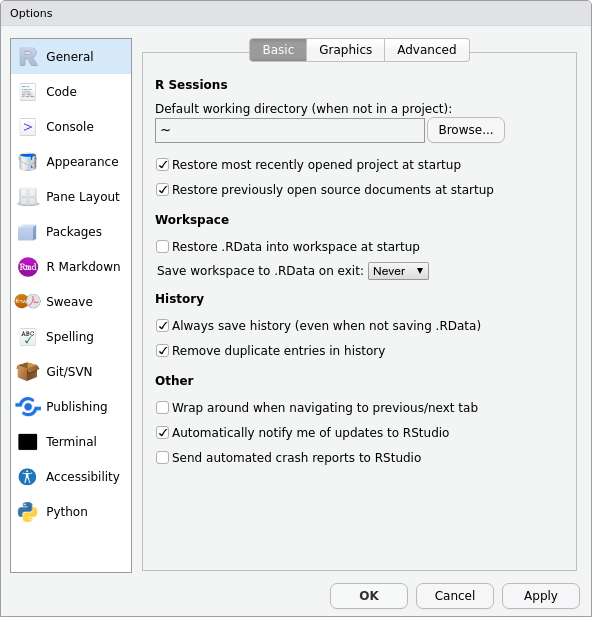

\appendix

# (PART) Annexes {-}

# Installation {#installation}

## Installer R {#r-installation}

R est fonctionne sur les principaux systèmes d'exploitation. Vous pouvez télécharger les fichiers d'installation depuis le [site du CRAN](https://cran.r-project.org/). Sous Windows et Mac OS, lancez l'exécutable après l'avoir téléchargé et suivez les étapes d'installation en laissant les options par défaut.

R est disponible dans les dépôts d'Ubuntu. Cependant, les paquets inclus dans les dépôts Ubuntu par défaut sont souvent un peu anciens. Il peut être préférable d'[installer R à partir du dépôt du CRAN](https://cran.r-project.org/bin/linux/ubuntu/fullREADME.html) pour bénéficier des dernières versions.

Pour installer R sur Ubuntu :

``` bash
sudo apt update
sudo apt -y install r-base r-base-dev
```

::: {.rmdimportant}
Des changements importants peuvent subvenir entre les versions de R, entraînant parfois des problèmes de compatibilité. Il est fortement recommandé d'utiliser la dernière version mineure de R et de maintenir son installation à jour.
:::

## Installer RStudio {#rstudio-installation}

RStudio est un environnement de développement intégré (*interactive development environment*, IDE)^[RStudio n'est pas le seul IDE, des utilisateurs avancés peuvent lui préférer [*Emacs Speaks Statistics*](https://ess.r-project.org/) (ESS), un plugin pour l'éditeur [Emacs](https://www.gnu.org/software/emacs/).]. RStudio *n'est pas* R, pas plus qu'il n'offre une interface graphique à R. Il s'agit d'un logiciel utilitaire qui permet d'éditer et d'exécuter votre code, ainsi que de réaliser des actions connexes telles que l'installation de packages ou l'import de données. RStudio dispose notamment d'un système de [gestion de projets](#projets) qui permet d'organiser son travail.

RStudio Desktop est disponible sous licence *open-source* pour les principaux systèmes d'exploitation et peut être [téléchargée depuis le site de la société éditrice](https://www.rstudio.com/products/rstudio/download/#download).

Pour installer RStudio sur Ubuntu, ouvrez un terminal dans le dossier de téléchargement et lancez la commande suivante (le nom du fichier peut différer en fonction de la version) :

``` bash
sudo dpkg -i rstudio-2021.09.2-382-amd64.deb
```

::: {.rmdimportant}
Après l'installation de RStudio, la première étape consiste à en changer les réglages par défaut, pour éviter qu'il ne conserve des éléments entre deux sessions de travail. Ouvrez les options globales (*Tools* > *Global Options...*) et modifiez les réglages suivants (fig. \@ref(fig:rstudio-settings)) :

* Décochez *Restore .RData into workspace at startup*.
* Réglez *Save workspace to .RData on exit* sur *never*.

Un fichier .RData stocke les données et les fonctions que vous créez dans chaque session de travail. Par défaut, RStudio enregistre automatiquement ce fichier à la fermeture, et le recharge lorsque vous démarrez RStudio. C'est une source de problèmes et de confusion. En effet, il peut en résulter que des objets temporaires créés au cours de brèves expériences et explorations s'attardent sur plusieurs sessions car ils sont automatiquement rechargés, contaminant ainsi l'espace de travail. La modification de ces deux paramètres vous épargnera bien des soucis lorsque vous apprendrez à utiliser l'environnement de R, et vous aidera à prendre le contrôle des données et des fonctions que vous créez avec R (en vous évitant de faire débuter tous vos scripts par `rm(list = ls())`). Dans la plupart des cas, il est plus simple et plus efficace de considérer le code que vous écrivez comme le produit le plus important lorsque vous travaillez sur l'analyse, et d'écrire des instructions spécifiques pour exporter (ou enregistrer) uniquement les résultats les plus importants (par exemple, certaines sorties tabulaires sous forme de [fichiers CSV](#csv), et des graphiques sous forme de fichiers PNG).
:::

```{r rstudio-settings, echo=FALSE, out.width="70%", fig.cap="Configuration globale de RStudio Desktop."}

```

L'interface de RStudio se présente sous la forme d'un ensemble d'onglets répartis en quadrants (fig. \@ref(fig:rstudio-desktop)). Par défaut, de haut en bas et de gauche à droite^[Pour plus de détails sur l'interface de RStudio, voir @verzani2012, @gandrud2018 et @racine2012] :

```{r rstudio-desktop, echo=FALSE, out.width='100%', out.extra='angle=90', fig.cap="L'interface de RStudio Desktop."}
knitr::include_graphics("images/rstudio-desktop.png")
```

* Le quadrant supérieur gauche est l'éditeur de texte : il contient les documents en cours d'édition (scripts...), permet d'explorer les données et offre un accès rapide à certaines commandes en fonction du contexte (exécuter un script, compiler un document...). C'est là que vous écrivez et éditez le code et le texte. Écrire du code signifie écrire en texte brut, sans gras, soulignement, italique ou autre formatage. L'apparence de l'éditeur de texte peut être modifiée dans RStudio en allant dans le menu déroulant *Tools*, et en sélectionnant *Global Options...*, puis en parcourant les options dans les sections *Code* et *Appearance* sur la liste de gauche. Il peut être utile d'afficher les caractères d'espacement (dans la section *Code*, onglet *Display*), et de vérifier toutes les options de complétion et de diagnostic (section *Code*, onglet *Completion* et *Diagnostics*). Le code dans l'éditeur de texte est le produit le plus important de votre travail, c'est donc une bonne idée de l'enregistrer dans un [endroit adapté](#projets), avec un nom significatif (généralement les fichiers de code R se terminent par .R, avec un R majuscule après le point), et de l'enregistrer fréquemment pendant que vous travaillez dessus pour minimiser le risque de perte accidentelle.
* Le quadrant supérieur droit peut comporter plusieurs onglets, en fonction de ce que vous faites. La plupart du temps, vous verrez un onglet *Environment* et un onglet *History*. L'onglet *History* contient l'historique des commandes exécutées dans la console. L'onglet *Environment* répertorie les objets qui sont actuellement disponibles dans votre session R. L'environnement est l'endroit où R stocke les résultats des calculs et des fonctions. Par exemple, si vous avez exécuté un code qui lit une feuille de calcul dans R et la stocke en tant qu'objet R, vous verrez cet objet répertorié dans l'onglet *Environment*. Cet onglet est utile car il vous permet d'obtenir en un coup d'œil des informations de base sur la taille des objets que vous créez (par exemple, le nombre de lignes et de colonnes). Il permet de vérifier rapidement le résultat de vos calculs et voir si votre code fonctionne comme prévu. L'environnement est un aspect important de R car il nous offre un système cohérent et flexible pour créer, combiner et manipuler différents types de données pendant notre analyse. Les environnements sont un concept de programmation avancé, et tout ce que nous devons faire ici est de noter qu'ils sont utiles, et qu'il n'y a rien de comparable à eux dans les tableurs.
L'onglet *History* contient l'historique des commandes que vous avez précédemment exécutées dans votre session R. Il est vivement recommande de sauvegarder votre code dans un fichier .R, même pour les analyses et les expériences les plus brèves. Si vous travaillez de manière expéditive sans enregistrer, vous pouvez utiliser l'historique pour parcourir vos commandes précédentes afin de les réutiliser et de les modifier. Vous pouvez également enregistrer l'historique de vos commandes R dans un fichier texte. Ce n'est cependant pas une méthode efficace pour garder une trace de votre travail. Une meilleure stratégie consiste à écrire du code dans l'éditeur de texte, entrecoupé de commentaires qui expliquent ce que fait le code, et d'enregistrer ce document sur votre ordinateur.
* Le quadrant inférieur droit permet de naviguer dans les fichiers, de visualiser les graphiques (générés depuis la console ou à l'aide d'un script), de [gérer les packages](#packages) et d'[afficher l'aide](#aide). Vous pouvez revenir aux graphiques précédents créés dans votre session actuelle. L'onglet *Plots* comporte un bouton *Export*" qui permet d'enregistrer facilement vos graphiques sous forme de fichiers image sur votre ordinateur (dans différents formats) ou de les copier dans le presse-papiers pour un transfert rapide par copier-coller. Ces fonctionnalités sont utiles pour itérer vers un graphique de qualité publication.
* Le quadrant inférieur gauche contient la [console](#r-console) où le code est exécuté. Il n'y a pas de boutons spécifiques à la console, l'interaction directe avec ce volet est donc limitée. La partie la plus importante de ce volet est l'invite de commande, qui débute par un chevron `>`, et lorsque ce volet est actif, un curseur clignotant apparaît.

::: {.rmdtip}

Il existe deux fonctions utiles de la console qui vous feront gagner du temps lorsque vous travaillerez avec R. La première est la touche de déplacement vers le haut de votre clavier, qui vous permet de réexécuter les commandes précédentes. Si vous placez votre curseur à l'invite et appuyez sur la touche de déplacement vers le haut, vous pouvez parcourir les lignes de code précédemment exécutées. Une fois que vous avez trouvé le code que vous voulez réexécuter, vous pouvez le modifier dans la console, si vous le souhaitez, ou simplement appuyer sur Entrée pour l'envoyer à l'interpréteur. La deuxième fonctionnalité pratique du volet console de RStudio est la petite icône en forme de flèche située à droite de la barre de titre de la console. Si vous regardez en haut du panneau de la console, vous verrez le mot *Console*, puis vous verrez un chemin d'accès à un dossier sur votre ordinateur, et à la fin de celui-ci, vous verrez une petite icône en forme de flèche courbée pointant vers la droite. Le chemin sur votre ordinateur dans la barre de titre de la console est votre [répertoire de travail](#projets). Si vous cliquez sur la petite flèche, le volet des fichiers s'ouvre pour afficher le contenu de votre répertoire de travail.

:::

# Aide mémoire {#cheat-sheet}

## Séquences {#fonctions-sequences}

```{r}
# Séquence de nombres entiers
1:10
```

```{r}
# Séquence de 1 à 10
seq(1, 10)

# Séquence de 1 à 10 par pas de 2
seq(1, 10, by = 2)
```

```{r}
# Séquence de 10 entiers
seq_len(10)
```

```{r}
# Séquence de même longueur qu'un objet (ici de 1 à 10)
x <- c(8.6, 4.1, 3.9, 7, 1.8, 6.9, 1.6, 3.8, 2.6, 5.5)
seq_along(x)
```

## Pipes {#fonctions-pipe}

L'opérateur `|>` (*pipe*) a été introduit dans la version 4.1 de R^[Pour les versions de R antérieures 4.1, on peut utiliser l'opérateur `%>%` du package [*magrittr*](https://magrittr.tidyverse.org/)]. Ainsi, `x |> f(y)` est interprété comme `f(x, y)`.

```{r}
mtcars |> 
  transform(avg = mpg / wt) |> 
  subset(avg > 5, select = c(mpg, wt, avg))
```

L'utilisation des *pipes* à l'avantage de clarifier et de faciliter la lecture du code, mais peut considérablement complexifier le débuggage en cas de problème. Il est recommandé d'utiliser cet opérateur avec parcimonie.

# Bonnes pratiques {#bonnes-pratiques}

# Style de programmation {#style}

Cette section propose un style de programmation destiné à accompagner les utilisatrices et utilisateurs débutants. Ce style regroupe des recommandations pour l'écriture du code et permet d'en faciliter la lecture et la compréhension. Ce style est dérivé du [*tidyverse style guide*](https://style.tidyverse.org) et du livre [*rOpenSci Packages*](https://devguide.ropensci.org).

## Dénominations {#style-naming}

En règle générale, les abréviations doivent être évitées lors de la dénomination de fichiers ou d'objets.

### Nommer les fichiers

Les noms de fichiers doivent utiliser l'extension `.R`.

```{r, echo=TRUE, eval=FALSE}
# GOOD
plot.R

# BAD
plot
```

Les noms de fichiers doivent être parlants.

```{r, echo=TRUE, eval=FALSE}
# GOOD
plot.R

# BAD
Untitled1.R
```

Les noms de fichiers ne doivent pas contenir de `/` et d'espaces. À la place, utilisez un tiret (`-`) ou un trait de soulignement (`_`).

```{r, echo=TRUE, eval=FALSE}
# GOOD
read_csv.R
plot-methods.R

# BAD
read csv.R
```

Les noms de fichiers doivent utiliser des lettres du latin de base, et non du supplément latin-1, et doivent être en minuscules.

```{r, echo=TRUE, eval=FALSE}
# GOOD
plot.R

# BAD
Plot.R
données.R
```

Utilisez des verbes signifiants pour les noms de fichiers.

```{r, echo=TRUE, eval=FALSE}
# GOOD
fit_model.R

# BAD
addition.R
```

Si le fichier ne contient qu'une seule fonction, nommez-le par le nom de la fonction.

### Nommer les variables

Les noms des variables doivent être aussi courts que possible.

Les noms des variables doivent être des substantifs évocateurs.

Les noms de variables doivent être en minuscules.

Ne séparez jamais les mots à l'intérieur du nom par `.` (réservé pour les méthodes S3) et n'écrivez pas en PascalCase (réservé pour les définitions de classes S4). Utilisez plutôt un trait de soulignement (`_`).

```{r, echo=TRUE, eval=FALSE}
# GOOD
std_dev <- 3

# BAD
std.dev <- 3
StdDev <- 3
```

N'utilisez pas les noms de fonctions et de variables existantes (en particulier celles qui sont propres à R).

```{r, echo=TRUE, eval=FALSE}
# GOOD
std_dev <- 3

# BAD
T <- 1
c <- 2 * 2
mean <- 10
```

### Nommer les fonctions

Les noms de fonction doivent contenir un verbe qui fait référence à l'action principale de la fonction.

Les noms de fonction doivent être en snake_case. N'utilisez `.` que pour le dispatching des méthodes S3.

Le schéma de nommage `object_verb()` doit être préféré aussi souvent que possible. Ce schéma est facile à lire et à compléter automatiquement.

```{r, echo=TRUE, eval=FALSE}
# GOOD
peak_detect()

# BAD
addition()
readFile()
```

Évitez de réemployer des noms de fonctions déjà utilisés par les packages de base ou d'autres packages populaires.

### Nommer les classes S4

Les noms des classes doivent être des substantifs en PascalCase avec une majuscule initiale et la première lettre de chaque mot concaténé en majuscule.

## Syntaxe {#style-syntax}

### Longueur de ligne

La longueur maximale des lignes est limitée à 80 caractères.

Ne mettez pas plus d'une déclaration par ligne. N'utilisez pas de point-virgule pour terminer la commande.

```{r, echo=TRUE, eval=FALSE}
# GOOD
x <- 1
x <- x + 1

# BAD 
x <- 1; x <- x + 1
```

### Appel de fonction {#style-fonction}

Dans un appel de fonction, spécifiez les arguments par leur nom. Ne spécifiez jamais les arguments par un nom partiel et ne mélangez jamais la position et le nom complet.

```{r, echo=TRUE, eval=FALSE}
# GOOD
mean(x, na.rm = TRUE)

# BAD
mean(x, na = TRUE)
```

Les arguments obligatoires doivent être placés en premier, suivis des arguments facultatifs.

```{r, echo=TRUE, eval=FALSE}
# GOOD
raise_to_power(x, power = 2.7)

# BAD
raise_to_power(power = 2.7, x)
```

L'argument `...` doit se trouver soit au début, soit à la fin.

```{r, echo=TRUE, eval=FALSE}
# GOOD
standardize(..., scale = TRUE, center = TRUE)

# BAD
standardize(scale = TRUE, ..., center = TRUE)
```

Définissez les arguments par défaut à l'intérieur de la fonction en utilisant l'idiome `NULL`, et évitez la dépendance entre les arguments.

Validez toujours les arguments dans une fonction.

### Espaces de nom

Si vous utilisez ponctuellement une unique fonction d'un package, utilisez `::` pour spécifier le nom du package au lieu de charger tout le package.

```{r, echo=TRUE, eval=FALSE}
# GOOD
FactoMineR::PCA()

# OK 
library(FactoMineR)
PCA()
```

L'utilisation des espaces de nom permet d'éviter les conflits lorsque deux packages ont une fonction du même nom et explicite l'origine de la fonction utilisée.

### Boucles

Utilisez `seq_along()` dans les boucles pour gérer correctement les cas où `x` est vide.

```{r}
# Soit un vecteur numérique de longueur nulle
x <- numeric(0)

# La boucle ne s'exécute pas (OK)
for (i in seq_along(x)) {
  print(i)
}

# La boucle s'exécute pour i=1 puis i=0 (!)
for (i in 1:length(x)) {
  print(i)
}
```

### Affectation

Utilisez `<-` au lieu de `=` pour l'affectation.

```{r, echo=TRUE, eval=FALSE}
# GOOD
x <- 1

# BAD
x = 1
1 -> x
```

### Espaces

Mettez des espaces autour de tous les opérateurs binaires infixes (`=`, `+`, `*`, `==`, `&&`, `<-`, `%*%`, etc.).

```{r, echo=TRUE, eval=FALSE}
# GOOD 
x == y
z <- 2 + 1

# BAD
x==y
z<-2+1
```

Mettez des espaces autour de `=` dans les appels de fonction.

```{r, echo=TRUE, eval=FALSE}
# GOOD 
mean(x = c(1, 2, 3), na.rm = TRUE)

# BAD
mean(x=c(1, 2, NA), na.rm=TRUE)
```

Ne placez pas d'espace pour obtenir des sous-ensembles (`$` et `@`), pour la manipulation des espaces de noms (`::` et `:::`) et pour la génération de séquences (`:`).

```{r, echo=TRUE, eval=FALSE}
# GOOD
car$cyl
dplyr::select()
1:10

# BAD
car $cyl
dplyr:: select()
1: 10
```

Mettez un espace après une virgule.

```{r, echo=TRUE, eval=FALSE}
# GOOD 
mtcars[1, ]
mean(x = c(1, NA, 2), na.rm = TRUE)

# BAD
mtcars[1 ,]
mean(x = c(1,NA,2),na.rm = TRUE)
```

Utilisez un espace avant les parenthèses ouvrantes, sauf dans un appel de fonction.

```{r, echo=TRUE, eval=FALSE}
# GOOD 
for (element in element_list)
if (total == 5)
sum(1:10)

# BAD
for(element in element_list)
if(total == 5)
sum (1:10)
```

Ne mettez pas d'espaces autour du code entre parenthèses ou entre crochets.

```{r, echo=TRUE, eval=FALSE}
# GOOD 
if (is_true) message("Hello!")
species["tiger", ]

# BAD
if ( is_true ) message("Hello!")
species[ "tiger" ,]
```

### Accolade

Une accolade ouvrante ne doit jamais être placée sur sa propre ligne et doit toujours être suivie d'une nouvelle ligne.

```{r, echo=TRUE, eval=FALSE}
# GOOD 
if (is_true) {
  # do something
}

if (is_true) {
  # do something
} else {
  # do something else
}
    
# BAD
if (is_true)
{
  # do something
}
    
if (is_true) { # do something }
else { # do something else }
```

Une accolade fermante doit toujours être placée sur sa propre ligne, sauf si elle est suivie de `else`.

```{r, echo=TRUE, eval=FALSE}
# GOOD 
if (is_true) {
  # do something
} else {
  # do something else
}

# BAD
if (is_true) {
  # do something
}
else {
  # do something else 
}
```

Indentez toujours le code à l'intérieur des accolades.

```{r, echo=TRUE, eval=FALSE}
# GOOD 
if (is_true) {
  # do something
  # and then something else
}

# BAD
if (is_true) {
  # do something
  # and then something else
}
```

Les accolades et les nouvelles lignes peuvent être évitées, si une déclaration après `if` est très courte.

```{r, echo=TRUE, eval=FALSE}
# OK 
if (is_true) return(value)
```

### Indentation

N'utilisez pas de tabulations ou de mélanges de tabulations et d'espaces pour l'indentation.

Utilisez deux espaces pour l'indentation.

### Nouvelle ligne

Dans une définition ou un appel de fonction, les arguments excessifs doivent être indentés sur la ligne de la parenthèse fermante, si deux lignes suffisent.

```{r, echo=TRUE, eval=FALSE}
# GOOD
long_function_name <- function(arg1, arg2, arg3, arg4, 
                               long_argument_name1 = TRUE)
  
plot(table(rpois(100, 5)), type = "h", col = "red", lwd = 10, 
     main = "rpois(100, lambda = 5)")
```

Sinon, chaque argument peut aller sur une ligne séparée, en commençant par une nouvelle ligne après la parenthèse ouvrante.

```{r, echo=TRUE, eval=FALSE}
# GOOD
long_function_name <- function(long_argument_name1 = c("value1", "value2"),
                               long_argument_name2 = TRUE,
                               long_argument_name3 = NULL,
                               long_argument_name4 = FALSE)
  
list(
  mean = mean(x),
  sd = sd(x),
  var = var(x),
  min = min(x),
  max = max(x),
  median = median(x)
)
```

Si la condition dans l'instruction `if` s'étend sur plusieurs lignes, alors chaque condition doit se terminer par un opérateur logique, et non commencer par lui.

```{r, echo=TRUE, eval=FALSE}
# GOOD
if (some_very_long_name_1 == 1 &&
    some_very_long_name_2 == 1 ||
    some_very_long_name_3 %in% some_very_long_name_4)
  
# BAD
if (some_very_long_name_1 == 1
    && some_very_long_name_2 == 1
    || some_very_long_name_3 %in% some_very_long_name_4)
```

Si l'instruction qui contient des opérateurs s'étend sur plusieurs lignes, chaque ligne doit se terminer par un opérateur et non commencer par lui.

```{r, echo=TRUE, eval=FALSE}
# GOOD 
normal_pdf <- 1 / sqrt(2 * pi * d_sigma ^ 2) *
  exp(-(x - d_mean) ^ 2 / 2 / s ^ 2)

# BAD
normal_pdf <- 1 / sqrt(2 * pi * d_sigma ^ 2)
* exp(-(x - d_mean) ^ 2 / 2 / d_sigma ^ 2)
```

Chaque appel de `dplyr` (après `%>%` ou `|>`) ou de `ggplot2` (après `+`) doit commencer sur une nouvelle ligne.

## Commentaires

Il est recommandé d'écrire les commentaires en anglais.

Les commentaires commencent par `#` suivi d'un espace et du texte du commentaire.

```{r, echo=TRUE, eval=FALSE}
# This is a comment.
```

Les commentaires doivent expliquer le pourquoi, et non le comment. Les commentaires doivent expliquer l'intention générale de la commande.

```{r, echo=TRUE, eval=FALSE}
# GOOD
# define iterator
i <- 1

# BAD
# set i to 1
i <- 1
```

De courts commentaires peuvent être placés sur la même ligne que le code code.

```{r, echo=TRUE, eval=FALSE}
plot(price, weight) # Plot a scatter chart of price and weight
```

Il peut être utile de diviser le code source en morceaux logiques par un commentaire suivi de `-` ou `=`.

```{r, echo=TRUE, eval=FALSE}
# Read data -------------------------------------------------------------

# Clean data ------------------------------------------------------------
```

Les descriptions des fonctions et des objets doivent respecter les directives de [*roxygen2*] (https://roxygen2.r-lib.org/).

```{r, echo=TRUE, eval=FALSE}
#' Add Together Two Numbers
#' 
#' @param x A number.
#' @param y A number.
#' @return The sum of x and y.
#' @examples
#' add(1, 1)
#' add(10, 1)
add <- function(x, y) {
  # general comment
  x + y # inline comment
}
```
