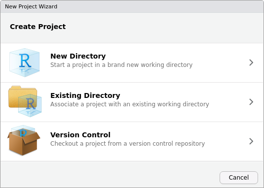
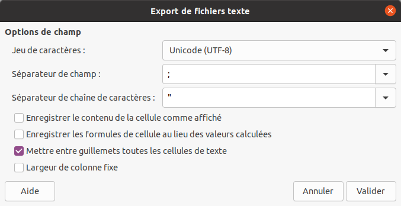

# (PART) Collecter et organiser ses données {-}

# Introduction

L'objectif de ce chapitre est d'expliquer comment des décisions prises avant et pendant la collecte des données peuvent permettre d'économiser du temps et des efforts plus tard, pendant le processus d'analyse et de visualisation des données, en utilisant R ou tout autre outil. Le chapitre est organisé de manière hiérarchique, en commençant par l'organisation des fichiers au niveau du projet, puis en descendant pour discuter de l'organisation efficace des feuilles de calcul (l'un des outils les plus courants pour collecter, partager et stocker les données archéologiques), et enfin au niveau très granulaire de la cellule individuelle dans une feuille de calcul.

Le gain de temps et d'efforts est bien sûr une motivation importante pour modifier vos comportements en matière de collecte et d'analyse des données, mais il existe une vision plus large qui concerne les principes d'organisation des données. Cette vision est double. La première est d'améliorer la reproductibilité de la recherche archéologique. Lorsqu'un projet est bien organisé, il est plus facile de trouver les fichiers clés pour vérifier les résultats précédents. Deuxièmement, l'interopérabilité à grande échelle des jeux de données, afin que les données archéologiques de divers projets puissent être facilement combinées pour répondre à des questions qu'aucun projet ne peut résoudre seul. Cette vision comporte de nombreuses autres dépendances, telles que la volonté de partager les données et de les rendre accessibles au public, ainsi qu'un accord sur ce qu'il faut mesurer et comment nommer les variables. Si le partage de vos données est la première étape pour permettre leur réutilisation, ce qui n'est pas encore courant en archéologie, pour que d'autres puissent facilement réutiliser vos données, elles doivent être faciles à comprendre [@white2013].

Une grande partie de ce chapitre ne présente pas de complexité particulière et peut sembler relever du bon sens. Cependant, les pratiques décrites ici font une grande différence quant à la réutilisation des données. Il nous semble donc important de les discuter directement et explicitement, plutôt que de supposer que tout un chacun les assimilera en cours de route sans conseils ou instructions spécifiques. Ce chapitre s'appuie sur des documents du domaine public, préparés à l'origine par Jenny Bryan, Karl Broman et d'autres pour le programme science reproductible de Data Carpentry, ainsi que sur des sources provenant d'autres disciplines, comme @borer2009, @sutter2015, @volk2014, @hampton2013, @strasser2012.

# Organiser ses fichiers

Le principe fondamental à suivre pour améliorer l'organisation de ses dossiers et fichiers est simplement d'avoir une stratégie et de s'y tenir. L'une des principales motivations de l'organisation des fichiers est de faciliter leur utilisation, à la fois pendant la durée de l'analyse et à l'avenir, lorsque vous ou d'autres personnes les utiliserez. Si vos fichiers sont bien organisés, une personne qui n'est pas familière avec votre projet (ce qui pourrait aussi être vous dans le futur) devrait être capable de regarder vos fichiers et de comprendre rapidement en détail ce que vous avez fait et pourquoi [@noble2009]. Une deuxième motivation pour être organisé est que de tout ce que vous faites pendant votre analyse, vous aurez probablement à le refaire. Nous explorons généralement de nombreuses options analytiques avec nos données, de sorte que le processus d'analyse des données ressemble davantage à un arbre ramifié qu'à une séquence unique d'actions consécutives. Nous revenons souvent à une étape antérieure de l'analyse pour étudier l'effet de la sélection de données particulières ou de l'ajustement  des paramètres d'un modèle. Si nous avons organisé et documenté clairement notre travail, il sera beaucoup plus facile de répéter les étapes précédentes de l'analyse avec des variations mineures.

## Travailler par projets {#projets}

Une bonne pratique liée à l'utilisation de R consiste à [organiser l'ensemble de son analyse en un projet](https://rstats.wtf/project-oriented-workflow.html), c'est à dire un dossier autonome contenant l'ensemble des fichiers nécessaires à l'analyse (dont les données brutes et le fichiers générés). Une telle organisation doit permettre de déplacer le dossier sur son ordinateur ou sur un autre ordinateur, tout en maintenant le bon fonctionnement du code (absence de liens brisés, de dépendances manquantes...). Ce dossier, appelé répertoire de travail (*working directory*), doit être **portable**.

Le répertoire de travail est un concept important à comprendre car il est différent de tout ce que vous avez pu voir dans un tableur. Le répertoire de travail est le répertoire (ou dossier) de votre ordinateur dans lequel R travaille actuellement. Il s'agit de l'emplacement sur votre ordinateur où R cherchera lorsque vous lirez des fichiers ou enregistrerez des résultats. Par défaut, le répertoire de travail de R a probablement été défini dans un répertoire peu pratique lors de l'installation de R, mais il est facile de le modifier.

Le répertoire de travail peut être défini ou retrouvé à l'aide des fonctions `setwd()` et `getwd()`, respectivement :

```{r, eval=FALSE}
# Définition du répertoire de travail
setwd("/chemin/vers/mon/dossier")
```

Une fois le répertoire de travail défini, toute référence à un fichier en utilisant un simple nom de fichier ou un chemin relatif sera interprétée relativement au répertoire de travail.

Cependant, cette approche n'est pas recommandée car le risque est de se retrouver dans la situation suivante :

```{r, eval=FALSE}
# Définition du répertoire de travail
setwd("/chemin/uniquement/valide/sur/mon/ordinateur")
```

Si vous utilisez la commande `setwd()` pour définir le répertoire de travail, votre code ne fonctionnera que sur votre ordinateur, dans sa configuration actuelle de fichiers et de dossiers. Cela signifie que votre code n'est pas portable et n'est pas robuste au changement. Si vous réorganisez vos fichiers ou si vous donnez votre code à un collaborateur, le répertoire de travail réel où se trouvent vos fichiers ne correspondra plus à ce qui est écrit dans le code. Cela peut entraîner des erreurs et de la frustration. Ainsi, bien qu'il soit important de connaître le concept de répertoire de travail pour travailler avec R, vous ne devez pas l'inclure dans votre code R.

Pour pallier ce problème qui rend difficilement déplaçable un dossier de projet, il existe différentes solutions parmi lesquelles :

* L'utilisation du package [*here*](https://here.r-lib.org/),
* L'utilisation de la gestion de projet dans RStudio.

RStudio dispose d'un mécanisme permettant de [créer facilement de tels projets](https://support.rstudio.com/hc/en-us/articles/200526207-Using-Projects). Il est possible de créer un projet dans RStudio à partir du menu déroulant situé en haut à droite de l'interface ou en cliquant sur *New Project...* depuis le menu *File*. Le projet peut alors être créé soit dans un nouveau dossier, soit en transformant un dossier existant (fig. \@ref(fig:rstudio-project)).

```{r rstudio-project, echo=FALSE, out.width="70%", fig.cap="Création d'un projet avec RStudio."}

```

Un projet créé par RStudio est reconnaissable par la présence d'un fichier `.Rproj`. Ce fichier marque le dossier de plus haut niveau au sein d'un projet (répertoire de travail), à partir duquel des chemins d'accès relatifs peuvent être utilisés pour lire ou écrire des fichiers. Le répertoire de travail est automatiquement définit lors de l'ouverture d'un projet RStudio : il n'est plus nécessaire d'utiliser `setwd()`.

Vous pouvez avoir besoin que votre code fasse référence à d'autres répertoires par rapport au répertoire principal de votre projet (par exemple, un répertoire appelé "data" qui contient des feuilles de calcul, etc.). L'organisation des fichiers et des sous-dossiers au sein d'un projet relève des habitudes de travail de chacun. S'il n'existe pas de consensus sur la manière d'organiser les fichiers à l'intérieur d'un projet, il peut cependant être avantageux de suivre certaines conventions (fig. \@ref(fig:xkcd-documents)), comme celles utilisées par le package [*rrtools*](https://github.com/benmarwick/rrtools) par exemple.

(ref:xkcd-documents) Documents. "Copy of Copy of Copy of Copy of Copy of Copy of Copy of Copy of Copy of Copy of Copy of Copy of Copy of Copy of Copy of Copy of Copy of Copy of Copy of Copy of Copy of Copy of Copy of Copy of Copy of Copy of Copy of Copy of Copy of Copy of Copy of Copy of Copy of Untitled.doc" [CC BY-NC 2.0 @munroe2014].

```{r xkcd-documents, echo=FALSE, out.width='50%', fig.cap="(ref:xkcd-documents)"}
knitr::include_graphics("images/xkcd_documents.png")
```

## Recommandations pour organiser ses fichiers

Au-delà d'avoir une stratégie pour organiser ses dossiers et fichiers, il existe plusieurs lignes directrices qui ont été proposées par des biologistes et des écologistes et qui sont applicables à la recherche archéologique [@noble2009; @white2013]. Ces directives reprennent le principe selon lequel l'organisation des fichiers doit indiquer les entrées et les sorties et le flux d'informations pendant l'analyse des données. Les directives les plus importantes sont que (1) les données brutes sont séparées des données dérivées, et (2) les données sont séparées du code.

Les **données brutes** désignent les fichiers de données tels qu'ils étaient lorsque vous les avez reçus à l'origine, par exemple transcrits à partir d'un cahier, saisis directement dans une base de données ou un tableur, ou téléchargés à partir d'un instrument tel qu'une station totale ou un analyseur XRF. Les **données dérivées** sont les données qui résultent des actions que vous entreprenez après avoir reçu les fichiers de données. Il s'agit de manipulations manuelles, telles que des modifications dans une feuille de calcul Excel, et de manipulations programmatiques qui se produisent lorsque vous utilisez le code R pour produire une version actualisée de vos données. Les manipulations manuelles sont à éviter autant que possible car elles ne laissent aucune trace, contrairement à une manipulation effectuée par code, ce qui les rend difficiles à défaire si vous changez d'avis. Si une manipulation manuelle est nécessaire dans vos données, vous devriez conserver un fichier de texte brut avec le fichier de données et y taper un bref récit des modifications apportées afin d'en avoir une trace. Une façon simple de séparer les données brutes des données dérivées consiste à avoir un dossier appelé `data/` qui contient deux répertoires, `raw_data/` et `derived_data/` (voir le schéma ci-dessous). L'utilisation d'une structure simple comme celle-ci signifie que vous n'avez besoin que d'une seule copie des fichiers de données brutes originaux dans vos fichiers de projet, plutôt que de les dupliquer à travers votre structure de fichiers, ce qui peut être une source de confusion importante pour savoir quel fichier est le bon.

```
|- data            # Données brutes et dérivées
|  |- raw_data     # Données brutes, ne seront jamais modifiées
|  +- derived_data # Données dérivées, jamais modifiées une fois créés
```

Cette pratique consistant à conserver les données brutes isolées de tout le reste signifie que vous êtes toujours en mesure de revenir aux premières étapes de votre analyse où vous avez lu les données brutes au cas où vous auriez besoin d'explorer une autre voie ou de vérifier vos résultats. C'est essentiel pour garantir la reproductibilité de votre recherche et pour avoir l'esprit tranquille en sachant que vous pouvez vérifier vos résultats. Si vous apportez de nombreuses modifications à vos fichiers de données brutes au cours de votre analyse, vous ne pourrez peut-être jamais revenir au début de votre analyse, vous n'aurez pas la possibilité de vérifier vos résultats et votre travail sera irreproductible. Le fait de conserver les données brutes intactes offre également aux autres chercheurs davantage d'options lorsqu'ils réutilisent vos données, ce qui augmente la valeur de votre travail pour la communauté de recherche plus large des archéologues.

Le deuxième principe d'organisation des fichiers que nous pouvons tirer des biologistes et des écologistes est étroitement lié : les données sont séparées du code. Lorsqu'on travaille avec un tableur, c'est une façon très peu naturelle de travailler. Dans une feuille de calcul, les formules qui calculent à partir les données sont situées directement à côté des cellules qui contiennent les données (par exemple, dans les lignes à droite ou sous les données). Bien que cela puisse être pratique pour travailler rapidement avec de petits tableaux de données, il en résulte une situation où il est difficile de distinguer les données brutes des données dérivées, et entre les données et les méthodes (c'est-à-dire les fonctions dans les cellules de la feuille de calcul). Ce mélange de données et de méthodes est un obstacle majeur à la reproductibilité et à l'ouverture, car la séquence des décisions prises au cours de l'analyse n'est pas explicite.

Votre code changera fréquemment pendant que vous travaillez sur une analyse, mais vos données brutes ne devraient pas changer. Si vous conservez ces fichiers dans des dossiers séparés, vous serez moins tenté de modifier les données brutes à la main pendant que vous écrivez du code. Il s'agit d'un principe de base de la conception de logiciels, qui permet de minimiser la confusion lors de la navigation dans les fichiers d'un projet. Une deuxième raison pour laquelle il est bon de séparer le code des données est que vous pouvez ne pas être en mesure de partager vos données brutes (par exemple, elles peuvent contenir des informations sensibles sur l'emplacement de sites archéologiques), mais vous pouvez être disposé à partager votre code. Lorsque ces deux composantes du projet sont bien séparées, il est facile de contrôler ce qui peut être rendu public et ce qui doit rester privé. Voici un exemple de structure de dossier de projet qui montre comment le code et les données peuvent être séparés :

```
|- data            # Données brutes et dérivées
|  |- raw_data     # Données brutes, ne seront jamais modifiées
|  +- derived_data # Données dérivées, jamais modifiées une fois créés
|
|- code            # Tout code, par exemple des fichiers de script R
```

Une troisième ligne directrice relative à l'idée générale de séparation consiste à garder les fichiers associés à la production de manuscrits ou de rapports séparés de tout le reste. Dans l'exemple ci-dessous, cela est représenté par le répertoire `paper/`. Il contient un (ou plusieurs) fichiers R Markdown qui documentent l'analyse sous forme exécutable. Cela signifie qu'il devrait être possible de convertir le document R Markdown en un fichier HTML/PDF/Word qui présente les principales méthodes, décisions et résultats de l'analyse. Ce fichier R Markdown pourrait se connecter au code dans le répertoire `code/` en utilisant la fonction source pour importer le code d'un script dans `code/` dans le fichier R Markdown. Cet exemple montre également comment organiser les fichiers pour les tableaux, les figures et autres images :

```
|- data            # Données brutes et dérivées
|  |- raw_data     # Données brutes, ne seront jamais modifiées
|  +- derived_data # Données dérivées, jamais modifiées une fois créés
|
|- code            # Tout code, par exemple des fichiers de script R
|
|- figures         # Figures du manuscrit
|
|- paper           # Tous les résultats des traitements et des analyses
|  |- report.md    # Un ou plusieurs fichier (R) markdown
|  |- ...
```

Une dernière directive liée au thème général de la séparation est d'avoir un répertoire "scratch" pour l'expérimentation. Ce répertoire doit contenir des bribes de code et de résultats produits lors de courts voyages sur des chemins alternatifs de l'analyse, lorsque vous voulez explorer certaines idées, mais que vous n'êtes pas sûr qu'elles seront pertinentes pour l'analyse principale. Si l'analyse expérimentale s'avère utile, vous pouvez alors l'incorporer à l'endroit approprié dans les dossiers du projet principal. Si l'expérience n'est pas directement pertinente pour l'analyse principale, vous pouvez la laisser dans le répertoire scratch ou la supprimer. Le détail le plus important concernant le répertoire scratch est que tout ce qui se trouve dans ce répertoire peut être supprimé à tout moment sans aucune conséquence négative pour votre projet. En général, je supprime mon répertoire scratch après la soumission ou la publication de mon article.

Une dernière directive, non liée à la séparation, consiste à inclure un fichier texte simple nommé "README" (par exemple "README.txt" ou "README.md") au niveau supérieur de la structure de fichiers d'un projet pour documenter quelques détails de base sur le projet. Cela peut inclure une douzaine de lignes de texte fournissant le nom du projet, les noms des personnes impliquées, une brève description du projet et un bref résumé du contenu des dossiers du projet. Vous pouvez également inclure des fichiers README similaires dans d'autres dossiers de votre projet, par exemple pour documenter les paramètres des instruments qui sont importants pour l'utilisation des données brutes. Vous trouverez ci-dessous un exemple de structure de fichier de projet comprenant un répertoire scratch et un fichier README :

```
|- data            # Données brutes et dérivées
|  |- raw_data     # Données brutes, ne seront jamais modifiées
|  +- derived_data # Données dérivées, jamais modifiées une fois créés
|
|- code            # Tout code, par exemple des fichiers de script R
|
|- figures         # Figures du manuscrit
|
|- paper           # Tous les résultats des traitements et des analyses
|  |- report.md    # Un ou plusieurs fichier (R) markdown
|  |- ...
|
|- README.txt      # La description du projet et de son contenu
```

Ces directives concernant la séparation sont largement applicables à la plupart des projets archéologiques, quelle que soit leur échelle ou leurs méthodes. Certains ajustements des détails fournis dans le schéma ci-dessus peuvent être nécessaires pour les ensembles de données importants ou sécurisés qui ne peuvent pas être stockés sur un ordinateur portable, et pour les calculs qui prennent beaucoup de temps. Dans tous les cas, le principe général de séparation reste un point de départ utile pour l'organisation des fichiers.

## Recommandations pour nommer ses fichiers

En tant qu'archéologues, nous sommes habitués à relever le défi de nommer les choses, lorsque nous travaillons avec des découvertes qui ne correspondent pas exactement aux typologies existantes, ou lorsque nous identifions des fragments d'objets qui n'ont pas d'attributs distinctifs [@kleindienst2006; @ferris1999]. Nous faisons souvent attention lorsque nous nommons des objets, car les noms sont une forme de communication et privilégient certaines interprétations et significations par rapport à d'autres. Souvent, en tant qu'archéologues, lorsque nous attribuons un nom, nous donnons naissance à quelque chose et délimitons ses frontières. Nous discutons de la signification des noms, tels que "Paléolithique moyen" ou "Acheuléen".

Cependant, étant donné que les nombreux produits numériques de notre travail analytique sont rarement rendus publics, nous ne mettons pas autant de soin et d'efforts à les nommer. De nombreux archéologues considèrent que les fichiers créés dans le cadre de l'analyse des données d'un projet sont leur propriété privée et peuvent être utilisés immédiatement. Ils ne pensent donc pas à les nommer de manière à gagner du temps et à faciliter la recherche de ces fichiers. Dans les grands projets, c'est peut-être moins vrai, mais d'après mon expérience, même en travaillant avec une douzaine de collaborateurs ou plus, le nommage des fichiers est souvent chaotique. Voici un exemple de noms de fichiers mal choisis :

```
resumé.docx
figure 1.png
Fig 2.png
article FINAL v.3 Jan22 introcorrigée.pdf
```

Pour remédier à ce chaos et rendre les fichiers plus faciles à utiliser et à réutiliser, nous pouvons utiliser deux principes pour nommer les fichiers : rendre les noms de fichiers lisibles par une machine et par les humains. Voici un exemple de noms de fichiers plus efficaces que ces directives nous aident à créer :

```
2022-01-17_resume_eaa.docx
fig01_dispersion-lithique-chaille.png
fig02_histogramme-lithique-chaille-eclats.png
```

Trois éléments des noms de fichiers lisibles par machine sont particulièrement importants dans les contextes de recherche. La première est que les noms de fichiers ne contiennent pas d'espaces, de signes de ponctuation (à quelques exceptions près) ou de caractères exotiques tels que les accents. La lisibilité par machine est également améliorée par une capitalisation cohérente des lettres, car pour un ordinateur, les majuscules et les minuscules d'une même lettre sont presque aussi différentes que A et Z le sont pour nous.

Le deuxième élément permettant de rendre les noms de fichiers lisibles par une machine est de les rendre faciles à calculer. Les noms de fichiers qui sont faciles à calculer utilisent délibérément des délimiteurs tels que le trait d'union et le trait de soulignement. Dans les exemples ci-dessus, les traits d'union sont utilisés pour délimiter les mots dans le nom de fichier et les chiffres dans les données. Mais le trait de soulignement est utilisé pour délimiter les unités de métadonnées dans le nom de fichier, par exemple pour séparer la date de la description, ou le numéro de figure de sa description. Cette utilisation prudente des délimiteurs signifie qu'il est possible d'extraire des métadonnées des noms de fichiers. Par exemple, nous pouvons utiliser R pour effectuer des calculs sur les noms de fichiers afin d'obtenir des données pertinentes pour notre analyse :

```{r}
# Lister les fichiers
fichiers <- list.files("data/raw_data/")

# Découper les noms de fichiers
# (récupère les informations contenues dans les noms)
info <- strsplit(fichiers, split = "_")

# Construire un tableau de métadonnées
as.data.frame(do.call(rbind, info))
```

L'utilisation judicieuse des délimiteurs peut rendre le travail avec un grand nombre de fichiers très efficace. En effet, nous pouvons utiliser R pour rechercher des fichiers ou des groupes de fichiers spécifiques et nous pouvons extraire des informations des noms de fichiers, comme illustré ci-dessus.

La troisième composante de la lisibilité automatique consiste à s'assurer que les noms de fichiers commencent par quelque chose qui fonctionne bien avec l'ordre par défaut. Souvent, la façon la plus simple de le faire est de mettre quelque chose de numérique en premier, comme une date ou une autre séquence de chiffres. Nous pouvons alors facilement utiliser l'affichage du bureau de notre ordinateur pour trier nos fichiers en fonction de la date ou d'un autre chiffre au début du nom du fichier. Il y a deux autres conditions à respecter pour que les noms de fichiers soient compatibles avec le classement. Vous devez utiliser la norme ISO 8601 pour les dates (AAAA-MM-JJ), sinon les dates ne seront pas automatiquement classées comme vous le souhaitez. Si vous n'utilisez pas de dates mais une simple séquence numérique, vous devez remplacer les chiffres par des zéros. C'est important pour garantir que, par exemple, les valeurs 10 à 19 seront reconnues par votre ordinateur comme supérieures à 2. Un bon exemple de préfixe numérique pour les noms de fichiers est 001_, 002_, 003_, etc. Un mauvais exemple est 1_, 2_, 3_, car 10_ sera trié par votre ordinateur et placé entre 1_ et 2_, plutôt qu'après 9_, comme vous vous y attendiez. Le principe de l'espacement à gauche des noms de fichiers fonctionne également lorsque ceux-ci sont préfixés par des caractères. Par exemple, Fig-01_, Fig-02_, Fig-03_ fonctionneront toujours avec l'ordre par défaut.

Rendre les noms de fichiers lisibles par les humains signifie inclure des informations sur le contenu du fichier dans son nom. Lorsqu'un nom de fichier contient des informations sur son contenu, il est facile pour les autres utilisateurs de comprendre ce qu'est le fichier et de décider comment l'utiliser.

# Organiser ses données
## Variables et observations
Les feuilles de calcul sont omniprésentes en archéologie, comme dans de nombreux autres domaines. Pour de nombreux chercheurs, la feuille de calcul est le pivot de leurs activités d'analyse de données. Ils y collectent des données, analysent et visualisent les résultats, et ils copient et collent les données de la feuille de calcul vers leurs rapports et manuscrits pour la publication. Les tableurs sont utiles pour collecter des données, mais ils sont inefficaces pour l'analyse (lorsque vous souhaitez modifier une variable ou effectuer une analyse avec un nouveau jeu de données, vous devez généralement tout refaire à la main), et ils rendent votre travail analytique difficile à suivre. En effet, les tableurs fonctionnent principalement par des opérations de glisser-déposer effectuées à l'aide de la souris et n'imposent donc pas un ordre linéaire facile à suivre à votre analyse.

En bref, l'utilisation de feuilles de calcul pour l'analyse des données est néfaste pour la reproductibilité et la transparence de votre recherche. Dans cette section, nous allons passer en revue quelques règles d'organisation des données dans les feuilles de calcul afin de faciliter leur utilisation. Ces règles sont valables pour tout langage de programmation, que vous utilisiez R, [Python](https://www.python.org/) ou [Julia](https://juliastats.org/).

Lors de l'acquisition puis lors de la préparation de vos données en vue d'une étude, toutes vos actions doivent être guidées par un impératif : structurer au mieux vos jeux de données pour en faciliter l'analyse [@wickham2014]. Les principes régissant cette étape de structuration (*data tidying*) sont exposés par @wickham2014, qui propose ainsi une approche pour lier "la structure d'un jeu de données (sa mise en forme) avec sa dimension sémantique (sa signification)."

Des jeux de données bien structurés se présentent sous la forme de tableaux à deux dimensions (lignes et colonnes) contenant des valeurs. Chaque valeur correspond à une observation d'une [variable](#variables) particulière, en conséquence :

* Chaque variable doit correspondre à une colonne du tableau.
* Chaque observation doit correspondre à une ligne du tableau.
* Un tableau doit correspondre à une unique unité d'observation^[On reconnait ici la troisième forme normale, dans le cas des bases de données relationnelles [@wickham2014].].

::: {.rmdtip}
Dans le cas de données tabulaires, utilisez le [format CSV](#csv).
:::

Les règles sont les suivantes : premièrement, placez toutes vos variables dans leurs propres colonnes (une variable est la caractéristique mesurée, comme la masse ou la longueur) et, deuxièmement, placez chaque observation dans sa propre ligne. La violation la plus courante de ces règles consiste à ne pas placer chaque variable dans sa propre colonne, de sorte qu'une colonne représente plus d'une variable.

Par exemple, le tableau ci-dessous est partiellement structuré. Chaque observation (c'est-à-dire chaque site archéologique) correspond bien à une ligne et le tableau dans son ensemble décrit une unique unité d'observation. Cependant, c'est un exemple typique de violation de la seconde règle.

| secteur | materiau            | total |
|:--------|:--------------------|------:|
| A       | cuivre              |     5 |
| A       | ceramique cuivre    |     9 |
| A       | ceramique os        |    30 |
| B       | ceramique os        |    12 |
| B       | ceramique           |    40 |
| B       | ceramique os cuivre |    32 |

La colonne *materiau*, contient le type de matériau observé sur chaque site. Sous cette forme, il est difficile de regrouper les sites par caractéristiques, par exemple pour n'extraire que les sites contenant des ossements. Une approche plus structurée serait d'avoir une colonne pour la présence de céramique, une colonne pour la la présence d'alliages cuivreux, et ainsi de suite. Chacune de ces colonnes peut alors être exploitée individuellement, et nous avons un contrôle plus fin sur les données.

| secteur | ceramique | cuivre | os | total |
|:--------|----------:|-------:|---:|------:|
| A       |         0 |      1 |  0 |     5 |
| A       |         1 |      1 |  0 |     9 |
| A       |         1 |      0 |  1 |    30 |
| B       |         1 |      0 |  1 |    12 |
| B       |         1 |      0 |  0 |    40 |
| B       |         1 |      1 |  1 |    32 |

Il est souvent tentant de combiner plusieurs informations dans une seule cellule, car cela permet d'accélérer la collecte des données en réduisant le temps passé à naviguer entre les champs. S'il vous est impossible d'éviter de combiner des informations dans une seule cellule, ou si les données ont été collectées par quelqu'un d'autre et qu'elles présentent déjà ce problème, il existe dans R des méthodes de nettoyage et de séparation que nous explorerons au chapitre \@ref(data-traitement). L'essentiel ici est de nettoyer et d'ordonner les données avant de les analyser, et avant de les archiver pour que d'autres puissent les utiliser.

La deuxième caractéristique des données ordonnées (chaque ligne du tableau correspond à une observation), est facile à réaliser lorsque l'on enregistre les données d'un ensemble de spécimens, tels que des artefacts ou des restes de faune. Dans cette situation, il est naturel qu'un artefact soit représenté par une ligne du tableau. Il est moins naturel de suivre cette règle lorsque, par exemple, chaque ligne représente un site, et que certaines des colonnes sont des comptages de types de poteries. Dans ce cas, la forme propre et ordonnée serait une ligne pour chaque combinaison site/type de poterie, mais cette forme est très peu pratique pour la collecte de données. Ainsi, pendant la collecte des données, nous pouvons tolérer un peu de désordre afin d'optimiser la vitesse et la commodité de la saisie des données. Dans le chapitre \@ref(data-traitement), nous explorerons les méthodes permettant de rendre les données collectées sur le terrain vraiment ordonnées et adaptées à l'analyse et à la visualisation.

En revanche, la troisième caractéristique des données ordonnées (un tableau doit correspondre à une unique unité) est simple à mettre en œuvre. Au sein d'une feuille de calcul, l'implication est que chaque feuille ne contient qu'un seul tableau. Chaque feuille doit comporter un seul rectangle contigu de données. Il faut donc résister à la tentation d'organiser une grille de petits tableaux sur une seule feuille (fig. \@ref(fig:data-messy-spreadsheet)). Bien qu'il s'agisse d'une stratégie courante pour organiser les données car elle permet de jeter un coup d'œil sur les petits tableaux pour les comparer, elle pose problème car chaque ligne de cette feuille contient plus d'une observation, une ligne couvrant plusieurs petits tableaux. De même, les noms des colonnes sont susceptibles d'être dupliqués car ils apparaissent dans chacun des petits tableaux. Ces complications rendent plus difficile le nettoyage et le rangement de vos données sous une forme utile pour l'analyse et la visualisation. La règle est d'un tableau par feuille, et si vous suivez cette règle, le rangement final de vos données pour l'analyse sera beaucoup plus simple et rapide. En apportant de petits changements à la façon dont vous organisez vos données dans les feuilles de calcul, vous pouvez avoir un impact considérable sur l'efficacité et la fiabilité du nettoyage et de l'analyse des données.

```{r data-messy-spreadsheet, echo=FALSE, fig.cap="Cette capture d'écran montre des données archéologiques désordonnées : plusieurs tableaux sur une feuille, plusieurs valeurs dans une colonne, plusieurs lignes d'en-tête pour un tableau, etc."}
knitr::include_graphics("images/data-messy-spreadsheet.png")
```

## Valeurs

Au niveau le plus granulaire de la collecte de données, on trouve la cellule individuelle d'une feuille de calcul ou le champ de saisie des données. De mauvaises habitudes dans la saisie des données peuvent nécessiter un temps considérable pour les corriger avant que ces données ne soient adaptées à l'analyse, et conduire à des erreurs dans les résultats, quel que soit le logiciel que vous utilisez. Je passe ici brièvement en revue certaines des erreurs courantes d'organisation des cellules dans l'espoir que si vous en êtes conscient, vous serez peut-être motivé pour les éviter dans votre collecte de données.

Le choix d'une bonne valeur nulle nécessite une réflexion approfondie. Lorsque vous savez que la valeur est égale à zéro, vous devez bien sûr entrer zéro. Mais lorsque la valeur n'a pas été mesurée, ou n'a pas pu être mesurée, vous ne voulez pas entrer zéro car cela implique que vous savez quelque chose sur la valeur. Vous ne voulez pas non plus laisser ce champ vide, car cela pourrait être interprété comme une omission de l'enregistrement de cette donnée. Les cellules vides sont ambiguës - le collecteur de données a-t-il omis ce champ par accident, ou n'a-t-il pas été en mesure d'enregistrer une valeur pour ce champ, ou encore la valeur était-elle nulle ? Le meilleur choix pour la valeur dont nous avons besoin dans cette situation est `NA` ou `NULL` [@white2013]. NA est un bon choix car il s'agit d'un mot spécial (ou réservé) dans le langage R, et R peut donc gérer les `NA` facilement. `NULL` peut être préférable si vos données utilisent `NA` comme abréviation, par exemple "Nouvelle-Aquitaine" (`NULL` est également un mot spécial dans R).

Un autre point délicat courant lors du passage de la collecte à l'analyse des données concerne les feuilles de calcul qui utilisent le formatage pour transmettre les informations. Par exemple, lorsqu'une cellule comporte un texte en couleur ou un surlignage pour indiquer une information supplémentaire sur ce spécimen ou cet enregistrement (fig. \@ref(fig:data-messy-spreadsheet-cell)). Des problèmes similaires se produisent lorsque du texte en gras ou en italique est utilisé pour signaler une qualité importante des données. Ce type d'utilisation est bien connu dans les tableaux publiés, par exemple l'utilisation du gras pour indiquer des valeurs statistiquement significatives. Mais au moment de la collecte des données, cette utilisation de la décoration des cellules et du texte pour transmettre l'information rend très difficile le calcul sur ces valeurs. Il est toujours préférable d'avoir une autre colonne pour capturer cette information, plutôt que de mettre en évidence la cellule ou de formater le texte.

```{r data-messy-spreadsheet-cell, echo=FALSE, out.width="70%", fig.cap="Cette capture d'écran montre le formatage d'une feuille de calcul. Dans ce cas, le surlignage jaune indique que des récipients complets ont été trouvés dans ce niveau. Une meilleure approche serait d'avoir une colonne appelée 'pots\\_complets', avec des valeurs indiquant le nombre de récipients complets dans chaque unité."}
knitr::include_graphics("images/data-messy-spreadsheet-cell.png")
```

Les éléments perturbateurs apparentés aux données de spreadshet sont les cellules fusionnées, les commentaires de cellule et l'inclusion d'unités de mesure dans une cellule, comme le symbole du pourcentage. Les cellules fusionnées peuvent rendre difficile le tri et le filtrage des données, ainsi que leur transfert dans d'autres programmes pour analyse. L'endroit approprié pour les commentaires est une colonne nommée "commentaires" et les unités doivent être exprimées dans l'en-tête de colonne, la même unité de mesure devant être utilisée pour chaque ligne d'une colonne. Lorsque vous ajoutez des en-têtes à vos colonnes, veillez à ne pas inclure d'espaces, de chiffres ou de caractères spéciaux. Une bonne alternative aux espaces dans les en-têtes de colonne sont les traits de soulignement ("_"), par exemple, "longueur_mm" est préférable à "Longueur (mm)", pour une colonne de valeurs de longueur exprimées en millimètres. Les noms de champ courts ou abrégés (c'est-à-dire les en-têtes de colonne) sont souvent souhaitables pendant la collecte des données pour économiser de l'espace à l'écran, mais ils peuvent devenir déroutants plus tard lorsque vous réexaminez les données pour les analyser. Il faut donc veiller à ce que les en-têtes de colonne ne soient pas trop ambigus et envisager de conserver un livre de codes ou un dictionnaire de données qui associe chaque en-tête de colonne à votre description de la variable et à la manière dont elle a été mesurée.

L'idée générale est de faire preuve de retenue lorsque vous travaillez avec des feuilles de calcul, et de résister à la tentation d'utiliser toutes ses fonctionnalités. Soyez attentif à l'utilisation en aval de vos données, par vous dans R, et par d'autres dans d'autres environnements logiciels. Nous ne pouvons pas optimiser notre collecte de données pour toutes les situations possibles, mais avec quelques règles, nous pouvons en améliorer l'organisation pour en faciliter l'analyse avec d'autres outils.

# Sauvegarder ses données {#csv}

Une fois vos données correctement structurées, choisissez un format de fichier adapté pour les archiver, les diffuser ou les réutiliser (fig. \@ref(fig:xkcd-norm)). De manière générale, conservez vos données dans un [fichier texte](https://fr.wikipedia.org/wiki/Fichier_texte).

Dans le cas des données tabulaires, utilisez le format <abbr title="comma-separated values">CSV</abbr>. Comme son nom l'indique, un fichier <abbr title="comma-separated values">CSV</abbr> est un fichier texte contenant des valeurs séparées par une virgule. Cette simplicité lui confère plusieurs avantages, ce qui en fait le format idéal pour pérenniser des données :

* Un fichier <abbr title="comma-separated values">CSV</abbr> est une suite de caractères et de retours à la ligne : il est facilement éditable et peut aussi bien être lu par un humain (les données ne sont pas encodées) que par une machine.
* Le format <abbr title="comma-separated values">CSV</abbr> est un format ouvert : son utilisation ne dépend pas d'un éditeur particulier. Un fichier <abbr title="comma-separated values">CSV</abbr> peut ainsi être lu ou écrit par n'importe quel logiciel capable de manipuler des feuilles de calcul (ou par un simple éditeur de texte).
* Le format <abbr title="comma-separated values">CSV</abbr> est un format bien établi (ses origines remontent aux années 1970), il ne risque pas de subir un [changement dramatique de spécification](https://www.bbc.com/news/technology-54423988).
* Son apparente austérité (il ne contient pas de formatage) oblige a structurer correctement ses données.

(ref:xkcd-norm) .NORM Normal File Format. "At some point, compression becomes an aesthetic design choice. Luckily, SVG is a really flexible format, so there's no reason it can't support vector JPEG artifacts." [CC BY-NC 2.0 @munroe2019].

```{r xkcd-norm, echo=FALSE, out.width='50%', fig.cap="(ref:xkcd-norm)"}
knitr::include_graphics("images/xkcd_norm_normal_file_format.png")
```

La simplicité et la souplesse de ce format nécessitent cependant un peu de prudence au moment de la création d'un fichier <abbr title="comma-separated values">CSV</abbr>. Il est en effet possible d'utiliser n'importe quel caractère en guise de séparateur à la place d'une virgule. Si votre tableur est paramétré en français, par défaut, les données seront séparées un point-virgule pour éviter les confusions avec le séparateur décimal (de même, lors de l'ouverture d'un fichier <abbr title="comma-separated values">CSV</abbr> votre éditeur s'attendra à trouver des valeurs séparées par un point-virgule). Pensez à bien paramétrer votre logiciel lors de l'import ou de l'export d'un fichier <abbr title="comma-separated values">CSV</abbr> dans un tableur (fig. \@ref(fig:calc-csv)).

```{r calc-csv, echo=FALSE, out.width="70%", fig.cap="Paramètres lors de l'export d'un fichier au format CSV avec LibreOffice Calc (choisissez l'encodage de caractères UTF-8 et un séparateur de champ adapté)."}

```

::: {.rmdcaution}
Méfiez-vous de votre tableur ! Ces derniers ont tendance à réaliser automatiquement des conversions qui ne sont pas sans [conséquences](https://www.theverge.com/2020/8/6/21355674/human-genes-rename-microsoft-excel-misreading-dates) lors de l'ouverture d'un fichier.
:::
