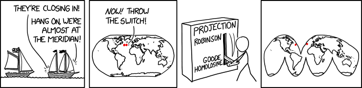

# (PART) Cartographie {-}

# Introduction

(ref:xkcd-sea-chase) Sea Chase. "There are two rules on this ship: Never gaze back into the projection abyss, and never touch the red button labeled DYMAXION." [CC BY-NC 2.0 @munroe2022].

```{r xkcd-sea-chase, echo=FALSE, out.width='100%', fig.cap="(ref:xkcd-sea-chase)"}

```

# Analyse de données vectorielles

# Analyse de données raster
