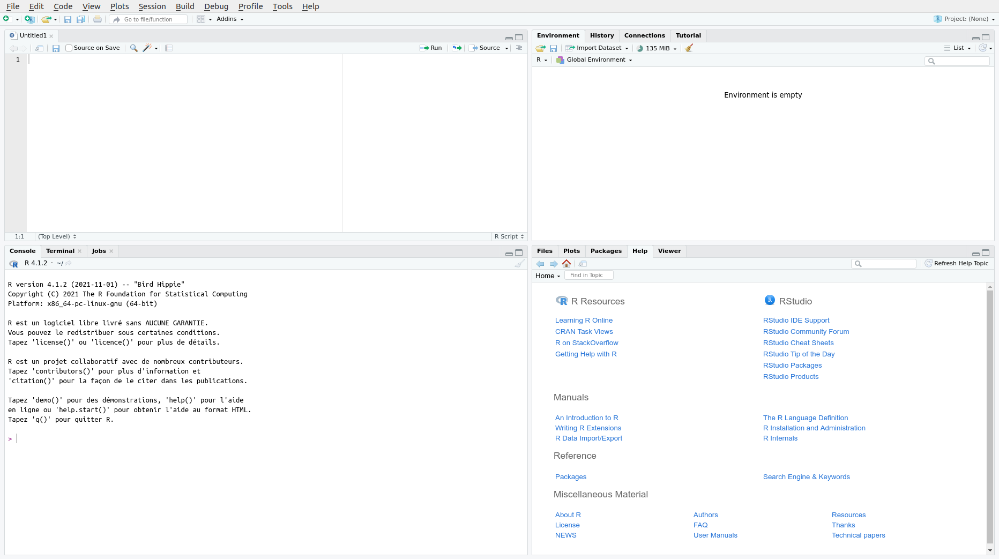

# Installation {.unnumbered #installation}

## Installer R {.unnumbered #r-installation}

R est fonctionne sur les principaux systèmes d'exploitation. Vous pouvez télécharger les fichiers d'installation depuis le [site du CRAN](https://cran.r-project.org/). Sous Windows et Mac OS, lancez l'exécutable après l'avoir téléchargé et suivez les étapes d'installation en laissant les options par défaut.

R est disponible dans les dépôts d'Ubuntu. Cependant, les paquets inclus dans les dépôts Ubuntu par défaut sont souvent un peu anciens. Il peut être préférable d'[installer R à partir du dépôt du CRAN](https://cran.r-project.org/bin/linux/ubuntu/fullREADME.html) pour bénéficier des dernières versions.

Pour installer R sur Ubuntu :

``` bash
sudo apt update
sudo apt -y install r-base r-base-dev
```

::: {.rmdimportant}
Des changements importants peuvent subvenir entre les versions de R, entraînant parfois des problèmes de compatibilité. Il est fortement recommandé d'utiliser la dernière version mineure de R et de maintenir son installation à jour.
:::

## Installer RStudio {.unnumbered #rstudio-installation}

RStudio est un environnement de développement intégré (*interactive development environment*, IDE)^[RStudio n'est pas le seul IDE, des utilisateurs avancés peuvent lui préférer [*Emacs Speaks Statistics*](https://ess.r-project.org/) (ESS), un plugin pour l'éditeur [Emacs](https://www.gnu.org/software/emacs/).]. RStudio *n'est pas* R, pas plus qu'il n'offre une interface graphique à R. Il s'agit d'un logiciel utilitaire qui permet d'éditer et d'exécuter votre code, ainsi que de réaliser des actions connexes telles que l'installation de packages ou l'import de données. RStudio dispose notamment d'un système de [gestion de projets](#projets) qui permet d'organiser son travail.

RStudio Desktop est disponible sous licence *open-source* pour les principaux systèmes d'exploitation et peut être [téléchargée depuis le site de la société éditrice](https://www.rstudio.com/products/rstudio/download/#download).

Pour installer RStudio sur Ubuntu, ouvrez un terminal dans le dossier de téléchargement et lancez la commande suivante (le nom du fichier peut différer en fonction de la version) :

``` bash
sudo dpkg -i rstudio-2021.09.2-382-amd64.deb
```

::: {.rmdimportant}
Après l'installation de RStudio, la première étape consiste à en changer les réglages par défaut, pour éviter qu'il ne conserve des éléments entre deux sessions de travail. Ouvrez les options globales et modifiez les réglages suivants (fig. \@ref(fig:rstudio-settings)) :

* Décochez *Restore .RData into workspace at startup*.
* Réglez *Save workspace to .RData on exit* sur *never*.

Ces deux réglages vous épargneront de mauvaises surprises (et vous éviteront de faire débuter tous vos scripts par `rm(list = ls())`).
:::

```{r rstudio-settings, echo=FALSE, fig.cap="Configuration globale de RStudio Desktop."}
knitr::include_graphics("images/rstudio-settings.png")
```

L'interface de RStudio se présente sous la forme d'un ensemble d'onglets répartis en quadrants (fig. \@ref(fig:rstudio-desktop)). Par défaut, de haut en bas et de gauche à droite :

* Le premier quadrant contient les documents en cours d'édition (scripts...), permet d'explorer les données et offre un accès rapide à certaines commandes en fonction du contexte (exécuter un script, compiler un document...).
* Le second quadrant permet d'accéder aux objets présent dans l'[environnement](#environnement) et de voir l'historique des commandes.
* Le troisième quadrant contient la [console](#console).
* Le quatrième quadrant permet de naviguer dans les fichiers, de visualiser les graphiques (générés depuis la console ou à l'aide d'un script), de [gérer les packages](#packages) et d'[afficher l'aide](#aide).

```{r rstudio-desktop, echo=FALSE, out.width='100%', fig.cap="L'interface de RStudio Desktop."}

```
